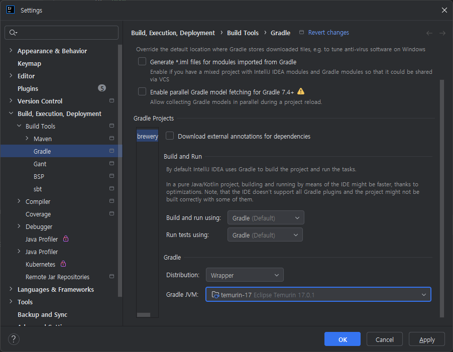

# Spigot plugin

[comment]: <> (!! Do not edit this file but 'docs/templates' or 'docs/root-templates', See [CONTRIBUTING.md] !!)

The [Spigot](https://www.spigotmc.org/wiki/about-spigot/) plugin provides you to:

- Generate 'plugin.yml' with less configuration.

- Shortcuts for [dependency](../README.md#dependencies) and [repository](../README.md#repositories).

## Table of contents

[comment]: <> (!! Do not edit this file but 'docs/templates' or 'docs/root-templates', See [CONTRIBUTING.md] !!)

- [Requirements](#requirements)

- [Usage](#usage)

- [Description file generation](#description-file-generation)

- [Main class detection](#main-class-detection)

- [Configuration](#configuration)

- [Tasks](#tasks)

- [Why not spigot-annotations?](#why-not-spigot-annotations)

- [Testing with MockBukkit](#testing-with-mockbukkit)

- [Migration Tips](#migration-tips)

- [Templates](#templates)

- [See also](#see-also)

## Requirements

[comment]: <> (!! Do not edit this file but 'docs/templates' or 'docs/root-templates', See [CONTRIBUTING.md] !!)

The plugin requires Gradle 8.0+, the latest version is recommended.

To update your gradle wrapper:

```
gradlew wrapper --gradle-version 8.14.3 --distribution-type all
```

## Usage

[comment]: <> (!! Do not edit this file but 'docs/templates' or 'docs/root-templates', See [CONTRIBUTING.md] !!)

[Full Example Here](https://github.com/spigradle/spigradle-sample/tree/master/spigot)

Groovy DSL

```groovy
plugins {
    id 'io.typst.spigradle' version '3.0.4'
}
```
Kotlin DSL

```kotlin
plugins {
    id("io.typst.spigradle") version "3.0.4"
}
```

<details>
<summary>Groovy Legacy</summary>

```groovy
buildscript {
    repositories {
        gradlePluginPortal()
    }
    dependencies {
        classpath 'kr.entree:spigradle:3.0.4'
    }
}

apply plugin: 'io.typst.spigradle'
```

</details>

<details>
<summary>Kotlin Legacy</summary>

```groovy
buildscript {
    repositories {
        gradlePluginPortal()
    }
    dependencies {
        classpath("kr.entree:spigradle:3.0.4")
    }
}

apply(plugin = "io.typst.spigradle")
```

</details>

## Description file generation

[comment]: <> (!! Do not edit this file but 'docs/templates' or 'docs/root-templates', See [CONTRIBUTING.md] !!)

The `plugin.yml` file will be generated by task `generateSpigotDescription` based on the [configuration of `spigot`](#configuration), included into output jars automatically.

Basically the properties 'main', 'name' and 'version' defaults to [auto-detected main](#main-class-detection), [project.name](https://docs.gradle.org/current/javadoc/org/gradle/api/Project.html#getName--), [project.version](https://docs.gradle.org/current/javadoc/org/gradle/api/Project.html#getName--) respectively.  So if we create a simple plugin that just needs those properties, we don't need any configuration. Only pay attention to your unique implementation.

You can configure all properties of `plugin.yml` in [spigot {} block](#configuration).

## Main class detection

[comment]: <> (!! Do not edit this file but 'docs/templates' or 'docs/root-templates', See [CONTRIBUTING.md] !!)

The plugin automatically finds the main class extends [JavaPlugin]((https://hub.spigotmc.org/javadocs/bukkit/org/bukkit/plugin/java/JavaPlugin.html)), and set the 'main' property to the class found.

```java
import io.typst.spigradle.annotations.SpigotPlugin;

@SpigotPlugin
public class SamplePlugin extends JavaPlugin { }
```  

```kotlin
@SpigotPlugin
class SamplePlugin : JavaPlugin()
``` 

### Exclusion

[comment]: <> (!! Do not edit this file but 'docs/templates' or 'docs/root-templates', See [CONTRIBUTING.md] !!)

If you want to exclude some plugins, this is an example,

Kotlin:

```kotlin
tasks {
    prepareSpigotPlugins {
        exclude("**/worldedit*.jar")
        exclude("**/worldguard*.jar")
    }
}
```

Groovy:

```groovy
prepareSpigotPlugins {
    exclude '**/worldedit*.jar' // or exclude 'worldedit*.jar'?
    exclude '**/worldguard*.jar'
}
```

Then WorldEdit and WorldGuard will be excluded by the `prepareSpigotPlugins` which a [Copy](https://docs.gradle.org/current/dsl/org.gradle.api.tasks.Copy.html) task, you can use all the `Copy` features.

## Configuration

[comment]: <> (!! Do not edit this file but 'docs/templates' or 'docs/root-templates', See [CONTRIBUTING.md] !!)

### spigot - [SpigotExtension](https://entree.dev/spigradle/docs/spigradle/io.typst.spigradle.module.spigot/-spigot-extension/index.html)

[comment]: <> (!! Do not edit this file but 'docs/templates' or 'docs/root-templates', See [CONTRIBUTING.md] !!)

The description of your plugin for a `plugin.yml`.

The 'main' property will be set to the class [auto-detected](#main-class-detection) or presented by `@io.typst.spigradle.annotations.SpigotMain`.

About the `plugin.yml`, See [plugin-yml wiki](https://www.spigotmc.org/wiki/plugin-yml/)

<details>
<summary>Groovy Example</summary>

```groovy
spigot {
    authors 'Me'
    depends 'ProtocolLib', 'Vault'
    softDepends 'WorldEdit'
    apiVersion '1.15'
    load STARTUP
    commands {
        give {
            aliases 'giv', 'i'
            description 'Give command.'
            permission 'test.foo'
            permissionMessage 'You do not have the permission!'
            usage '/<command> [item] [amount]'
        }
    }
    permissions {
        'test.foo' {
            description 'Allows foo command'
            defaults 'true'
        }
        'test.*' {
            description 'Wildcard permission'
            defaults 'op'
            children = ['test.foo': true]
        }
    }
}
```

</details>

<details>
<summary>Kotlin Example</summary>

```kotlin
spigot {
    authors = listOf("Me")
    depends = listOf("ProtocolLib")
    softDepends = listOf("WorldEdit")
    apiVersion = "1.15"
    load = Load.STARTUP
    commands {
        create("give") {
            aliases = listOf("i")
            description = "Give command."
            permission = "test.foo"
            permissionMessage = "You do not have permission!"
            usage = "/<command> [test|stop]"
        }
    }
    permissions {
        create("test.foo") {
            description = "Allows foo command"
            defaults = "true"
        }
        create("test.*") {
            description = "Wildcard permission"
            defaults = "op"
            children = mapOf("test.foo" to true)
        }
    }
}
```

Without [type-safe accessors](https://docs.gradle.org/current/userguide/kotlin_dsl.html#sec:kotlin_using_standard_api):

```kotlin
configure<SpigotExtension> {
    authors = listOf("Me")  
    // ...
}
```

</details>

## Tasks

[comment]: <> (!! Do not edit this file but 'docs/templates' or 'docs/root-templates', See [CONTRIBUTING.md] !!)

All tasks supports [UP-TO-DATE check](https://docs.gradle.org/current/userguide/more_about_tasks.html#sec:up_to_date_checks).

<details>
<summary>Configuration Guide</summary>

Groovy:

```groovy
runSpigot {
    jvmArgs('-Xmx8G')
}
```

Kotlin with type-safe accessors:

```kotlin
tasks {
    runSpigot {
        jvmArgs("-Xmx8G")
    }
}
```

Kotlin without [type-safe accessors](https://docs.gradle.org/current/userguide/kotlin_dsl.html#sec:kotlin_using_standard_api):

```kotlin
tasks {
    named<JavaExec>("runSpigot") {
        jvmArgs("-Xmx8G")
    }
}
```

Kotlin with property delegation

```kotlin
tasks {
    val runSpigot by existing(JavaExec::clas) {
        jvmArgs("-Xmx8G")
    }
    // Do something with 'runSpigot'
}
```

</details>

### detectSpigotMain - [SubclassDetection](https://entree.dev/spigradle/docs/spigradle/io.typst.spigradle.module.common/-subclass-detection/index.html)

[comment]: <> (!! Do not edit this file but 'docs/templates' or 'docs/root-templates', See [CONTRIBUTING.md] !!)

Finds the main class extends [org.bukkit.plugin.java.JavaPlugin](https://hub.spigotmc.org/javadocs/bukkit/org/bukkit/plugin/java/JavaPlugin.html).

### generateSpigotDescription - [YamlGenerate](https://entree.dev/spigradle/docs/spigradle/io.typst.spigradle.module.common/-yaml-generate/index.html)

[comment]: <> (!! Do not edit this file but 'docs/templates' or 'docs/root-templates', See [CONTRIBUTING.md] !!)

*Depends on: `detectSpigotMain`*

Generates the description file 'plugin.yml'.

## Why not spigot-annotations?

[comment]: <> (!! Do not edit this file but 'docs/templates' or 'docs/root-templates', See [CONTRIBUTING.md] !!)

```kotlin
@Plugin(name = "SamplePlugin", version = "1.0-SNAPSHOT")
@Commands(@Command(name = "foo", desc = "Foo command", aliases = ["foobar", "fubar"], permission = "test.foo", permissionMessage = "You do not have permission!", usage = "/<command> [test|stop]"))
@Permission(name = "test.foo", desc = "Allows foo command", defaultValue = PermissionDefault.OP)
class SamplePlugin : JavaPlugin()
```

If you use Gradle, the following reasons why no [spigot-annotations](https://hub.spigotmc.org/stash/projects/SPIGOT/repos/plugin-annotations/browse):

1. Duplicate information of the `name` and `version`, these already provided in `build.gradle` and `settings.gradle`.
2. The Annotation doesn't suit for providing complex information like `commands` and `permissions`.
3. Using Gradle, we can configure all things programmatically.

Replacement on build.gradle:

```groovy
spigot {
    // The 'name' and 'version' will be set to project.version and project.name, 
    // But we may set those manually.
    name = 'Manual name'
    version = 'Manual version'
    commands {
        foo {
            aliases = ['foobar', 'fubar']
            description = 'Foo command'
            permission = 'test.foo'
            permissionMessage = 'You do not have permission!'
            usage = '/<command> [test|stop]'
        }
    }
    permissions {
        'test.foo' {
            description = 'Allows foo command'
            defaults = 'op'
        }
    }
}
```

## Testing with MockBukkit

[comment]: <> (!! Do not edit this file but 'docs/templates' or 'docs/root-templates', See [CONTRIBUTING.md] !!)

With Spigradle 1.3.0+, you can use the [MockBukkit](https://github.com/seeseemelk/MockBukkit) without any special code.

If you use less than 1.3.0, add it in build.gradle:

```groovy
task copyPluginYaml(type: Copy, dependsOn: spigotPluginYaml) {
    from(new File(spigotPluginYaml.temporaryDir, 'plugin.yml'))
    into(sourceSets.test.output.resourcesDir)
}

tasks.test.dependsOn(copyPluginYaml)
```

## Migration Tips

[comment]: <> (!! Do not edit this file but 'docs/templates' or 'docs/root-templates', See [CONTRIBUTING.md] !!)

### 3.x <- 2.x

[comment]: <> (!! Do not edit this file but 'docs/templates' or 'docs/root-templates', See [CONTRIBUTING.md] !!)

- The groupId has been changed from `kr.entree.spigradle` to `io.typst.spigradle`.
- No more implicit repo/dep: need to declare repository(spigotmc)
- No more @Plugin annotation: the main class will be detected automatically.
- The debug feature is removed at this time
- The Gradle version must be 8.x or higher (ex: 8.14.3)
- The Gradle JVM version must be 17 or higher.




### 2.x <- 1.x

[comment]: <> (!! Do not edit this file but 'docs/templates' or 'docs/root-templates', See [CONTRIBUTING.md] !!)

- The task `spigotPluginYaml` renamed to `generateSpigotDescription`
- The annotation `@Plugin` repackaged to `@io.typst.spigradle.annotations.Plugin`.

## Templates

[comment]: <> (!! Do not edit this file but 'docs/templates' or 'docs/root-templates', See [CONTRIBUTING.md] !!)

[spigot-plugin-template](https://github.com/Silthus/spigot-plugin-template) by @Silthus

[BukkitJavaGradle](https://github.com/PluginTemplates/BukkitJavaGradle) by @portlek

## See also

[comment]: <> (!! Do not edit this file but 'docs/templates' or 'docs/root-templates', See [CONTRIBUTING.md] !!)

- [The Bungeecord plugin](bungeecord_plugin.md)
- [The Nukkit plugin](nukkit_plugin.md)
- [README.md](../README.md)
- [Gradle Kotlin DSL Primer](https://docs.gradle.org/current/userguide/kotlin_dsl.html)